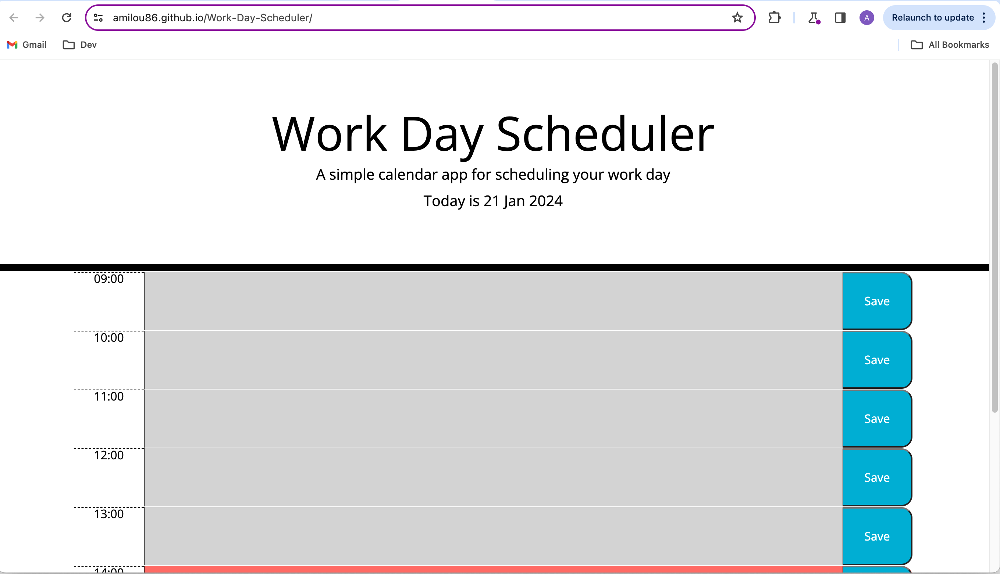

# Work-Day-Scheduler
A simple calendar application that allows a user to save events for each hour of the day

## User Story

AS AN employee with a busy schedule
I WANT to add important events to a daily planner
SO THAT I can manage my time effectively

## Acceptance Criteria

The app should:

* Display the current day at the top of the calender when a user opens the planner.
 
* Present timeblocks for standard business hours when the user scrolls down.
 
* Color-code each timeblock based on past, present, and future when the timeblock is viewed.
 
* Allow a user to enter an event when they click a timeblock

* Save the event in local storage when the save button is clicked in that timeblock.

* Persist events between refreshes of a page

The following animation demonstrates the application functionality:

*** LINK TO DEPLOYED APP *** - https://amilou86.github.io/Work-Day-Scheduler/

